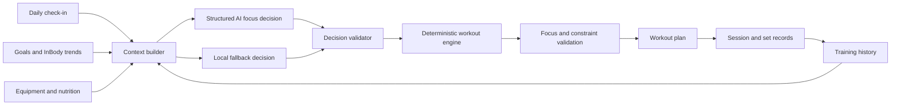

# Fitness AI

> A constraint-aware daily fitness coach that combines structured AI decisions,
> deterministic workout planning, and personal training data.

Fitness AI turns a user's daily condition, training history, goals, available
equipment, schedule, nutrition, and body-composition trends into an actionable
workout plan. Instead of asking a language model to invent an entire routine,
the system separates high-level reasoning from exercise selection:

1. An OpenAI model selects the session focus through a strict JSON schema.
2. A deterministic planning engine maps that focus to valid exercises and equipment.
3. Validation layers remove unsafe, unavailable, or out-of-focus recommendations.
4. A local fallback planner keeps the core workflow available when AI is unavailable.

The current interface is optimized for Korean users and supports a local guest
mode as well as Supabase-backed accounts and cloud synchronization.

## Why This Project

Static workout templates rarely reflect what changes from day to day. A useful
plan should account for questions such as:

- Is the user recovered enough to train a muscle group again?
- Are pain, soreness, or schedule constraints present today?
- Which machines and free weights are actually available?
- Is recent training volume aligned with the user's long-term goal?
- How should the plan change when the available time is reduced?
- Can the system still produce a valid plan if the AI request fails?

Fitness AI models these factors explicitly and treats pain, unavailable
equipment, excluded muscles, and incompatible movements as hard constraints.

## Key Features

| Area | What the system does |
| --- | --- |
| Daily readiness | Uses sleep, condition, soreness, pain, schedule, and available time |
| Adaptive planning | Chooses a daily focus and generates an equipment-aware workout |
| Training history | Tracks sessions, sets, RPE/RIR, volume load, and estimated 1RM trends |
| Focus enforcement | Prevents unrelated exercises from leaking into a focused session |
| Body composition | Imports InBody CSV exports and summarizes multi-record trends |
| Nutrition | Reallocates daily calorie and macro targets across remaining meals |
| Equipment | Supports availability, preferences, substitutions, and movement compatibility |
| Reliability | Uses schema-constrained AI output, validation, timeout/retry, and local fallback |
| Persistence | Provides per-profile local storage and optional Supabase cloud snapshots |

## System Architecture



The LLM is intentionally limited to the part of the workflow that benefits from
contextual reasoning. Concrete exercise and equipment selection remains
deterministic and testable.

## Decision Pipeline

### 1. Build a daily context

The application combines:

- training intent, sleep, readiness, soreness, and pain;
- time and schedule constraints;
- long-term body and training goals;
- recent effective sets and recovery estimates by muscle group;
- exercise performance and estimated 1RM trends;
- available and disabled equipment;
- nutrition status and InBody trends.

### 2. Select a training focus

The OpenAI Responses API returns a structured decision containing the session
mode, selected and blocked muscles, movement slots, estimated duration,
reasoning evidence, warnings, confidence, and fallback status.

### 3. Generate the workout

The workout engine scores compatible exercises and equipment, applies time and
volume prescriptions, and avoids recently repeated or unavailable options.

### 4. Validate the final plan

The focus policy checks that every exercise:

- belongs to an allowed movement family;
- targets the selected muscle or an approved accessory muscle;
- avoids pain and explicitly blocked areas;
- respects equipment and schedule constraints.

If the AI request fails, times out, or produces an invalid decision, the same
pipeline continues with a deterministic fallback.

## Reliability and Safety Design

- Strict JSON-schema output for AI training decisions
- Absolute constraints for pain and forbidden muscles
- Equipment capability and availability checks
- Post-generation focus validation
- 20-second AI timeout with one retry
- Deterministic local fallback planner
- Scenario-based tests for conflicting goals and constraints
- Supabase Row Level Security for user-owned cloud snapshots

This project provides planning guardrails, not medical diagnosis or treatment.

## Tech Stack

- **Frontend:** Next.js 15, React 19, TypeScript, Tailwind CSS
- **AI:** OpenAI Responses API with structured outputs
- **Data and auth:** Supabase Auth, PostgreSQL, Row Level Security
- **Persistence:** Local Storage with optional Supabase snapshot sync
- **Deployment:** Vercel
- **Quality:** ESLint, TypeScript type checking, scenario-based Node tests

## Repository Structure

```text
src/
  app/                  Next.js routes and AI API endpoints
  components/           Dashboards, planners, settings, and session views
  lib/
    daily-planning.ts   Context construction, fallback logic, and validation
    workout-engine.ts   Exercise and equipment selection
    focus-policy.ts     Session focus contract and final-plan checks
    history-analysis.ts Training volume, recovery, and performance trends
    inbody.ts           InBody CSV parsing and trend summaries
    nutrition.ts        Daily calorie and macro allocation
    openai-server.ts    Structured AI requests, timeout, retry, and fallback
    __tests__/           Core end-to-end planning scenarios
supabase/
  schema.sql            Normalized domain tables, snapshots, and RLS policies
```

## Getting Started

### Prerequisites

- Node.js 20 or later
- npm
- Optional: an OpenAI API key
- Optional: a Supabase project for authentication and cloud sync

### Installation

```bash
git clone https://github.com/michael1119676/fitness-ai.git
cd fitness-ai
npm install
cp .env.local.example .env.local
npm run dev
```

Open [http://localhost:3000](http://localhost:3000).

The application can be explored in guest mode. Without `OPENAI_API_KEY`, the
training workflow uses the local fallback planner. Supabase credentials are
required only for account authentication and cloud synchronization.

### Environment Variables

```env
OPENAI_API_KEY=your_openai_api_key
OPENAI_MODEL=gpt-5.5
NEXT_PUBLIC_SUPABASE_URL=https://your-project-ref.supabase.co
NEXT_PUBLIC_SUPABASE_ANON_KEY=your_supabase_anon_key
```

Never commit real credentials. The included example contains placeholders only.

### Supabase and Deployment

Run [`supabase/schema.sql`](supabase/schema.sql) in the Supabase SQL Editor and
follow [`DEPLOYMENT.md`](DEPLOYMENT.md) for authentication, cloud sync, and
Vercel configuration.

## Verification

```bash
npm run lint
npm run typecheck
npm test
npm run build
```

The core scenarios cover combinations such as limited equipment, blocked muscle
groups, short sessions, recovery constraints, nutrition adjustments, InBody
imports, and workout-record migrations.

## Current Status

Fitness AI is an actively developed prototype. The current implementation
prioritizes explainable decision flow and robust fallback behavior. Planned
extensions include normalized cloud persistence for all workout entities,
expanded automated tests, longitudinal model evaluation, and richer
recommendation-quality metrics.

