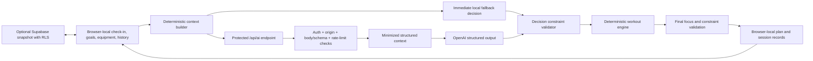

# Fitness AI

[](https://github.com/michael1119676/fitness-ai/actions/workflows/ci.yml)

> A constraint-aware daily fitness coach built around structured AI decisions, deterministic recommendation logic, explicit validation, and a local fallback.

[Live demo](https://pitness-ai.vercel.app) · [Repository](https://github.com/michael1119676/fitness-ai) · [Measured evaluation](docs/evaluation-results.md)

Fitness AI converts daily readiness, training history, goals, available equipment, schedule constraints, nutrition status, and body-composition trends into an actionable workout. The language model does not invent a finished routine. It proposes a bounded, structured focus decision; deterministic code owns exercise selection and the final safety checks.

The interface is Korean-first. Account data can be synchronized through Supabase, while the public guest flow uses a clearly labeled synthetic profile and browser-local storage.

## Responsibility boundary

| Layer | Owns | Does not own |
| --- | --- | --- |
| Structured AI decision | Session mode, focus muscles, movement slots, short reasoning | Exercise names, equipment selection, bypassing constraints |
| Deterministic planning | Context construction, recovery/volume calculation, exercise and equipment scoring, set/rep/rest prescription | Free-form medical judgment |
| Constraint validation | Pain/forbidden muscles, movement capabilities, focus policy, unavailable equipment, time limit | Diagnosing whether pain is medically safe |
| Local fallback | A deterministic focus decision when AI is disabled, rejected, unavailable, or invalid | Claiming model-equivalent quality |

This separation makes the cost-bearing and probabilistic part small. The final workout always passes through the same deterministic engine and validators, whether its initial focus came from OpenAI or the local fallback.

## Decision and data flow



The UI creates and persists a usable fallback plan before it requests AI refinement. A rejected or failed AI request therefore does not block the workout flow.

Before an OpenAI request, free-form goal notes, schedule memos, nutrition notes, InBody device names, and raw imported CSV fields are removed. The provider receives the bounded context needed for the decision, not the entire local application snapshot. Health payloads and provider error messages are not written to server logs; logs contain only a request ID, route/operation, safe error code, and fallback flag.

## Protected AI API

Every `POST /api/ai/*` route uses the same server-side guard:

- Supabase bearer-token verification for account users;
- guest AI disabled by default (`AI_GUEST_ACCESS_ENABLED=false`);
- strict same-origin browser policy;
- streaming request-size enforcement (12–48 KiB by route), including requests without `Content-Length`;
- runtime structural and semantic validation with bounded depth, nodes, arrays, strings, enums, and numeric ranges;
- per-user and per-IP hourly quotas;
- a Supabase atomic quota function on Vercel, which fails closed if durable rate limiting is not configured;
- one OpenAI attempt, a 12-second timeout, and bounded output tokens;
- consistent non-cacheable error envelopes with no provider details or health data.

Guest mode and guest AI are different policies. Anyone may explore the deterministic demo locally; anonymous requests only reach OpenAI when the deployer explicitly enables guest AI and installs the durable quota backend.

## Deterministic pipeline

1. `buildDailyTrainingContext` derives sleep/readiness, hard constraints, muscle history, movement capabilities, body-composition trend, and nutrition status.
2. The AI or fallback produces a `DailyTrainingDecision`, never concrete exercises.
3. `validateDailyTrainingDecision` removes forbidden, unavailable, out-of-focus, and over-time slots. An empty unsafe decision becomes `rest_recommended`.
4. `generateWorkoutPlanFromDecision` maps valid slots to catalog exercises and currently available equipment.
5. The final focus/constraint validator removes leaks and completes volume only inside the permitted focus.

The large orchestration files retain their existing public imports, while static policy data now lives in responsibility-specific modules:

- `src/lib/daily-planning/catalog.ts`
- `src/lib/daily-planning/decision-schema.ts`
- `src/lib/workout-engine/slots.ts`
- `src/lib/ai-api/*`
- `src/lib/evaluation/*`

## Evaluation

Run:

```bash
npm test
npm run evaluate
```

The 21 core scenarios cover pain, soreness, forbidden regions, unavailable equipment, machine-only mode, short sessions, malformed AI slots, no-equipment fallback, explicit rest, low recovery, nutrition boundaries, InBody parsing, time-zone behavior, and record migration. API tests also exercise every AI route's authentication envelope, guest rate limiting, runtime schema rejection, media-type enforcement, and payload limits.

`npm run evaluate` executes 10 deterministic synthetic scenarios and computes:

- constraint-violation scenario rate;
- valid-plan rate;
- fallback success rate.

The checked-in [evaluation report](docs/evaluation-results.md) was generated from the current code. Its measured result is 0/10 scenarios with a detected constraint violation, 10/10 valid plans, and 9/9 successful fallback scenarios. These are deterministic test-harness results, not medical accuracy, live-model quality, latency, or production reliability claims.

## Failure modes

| Failure | Behavior |
| --- | --- |
| No OpenAI key | Return the deterministic fallback |
| Missing/invalid login token | Reject the AI request; keep the already-created local plan |
| Guest AI not enabled | Reject the AI request; public demo remains deterministic |
| Missing production quota backend | Fail closed before OpenAI |
| Oversized, malformed, or wrong-content-type body | Reject before domain/OpenAI processing |
| OpenAI timeout/provider error/invalid JSON | Use fallback without exposing provider details |
| AI selects pain/forbidden/out-of-focus slot | Remove it during deterministic validation |
| No safe slot or no usable equipment | Recommend rest; never fill with unrelated exercises |
| Supabase unavailable | Local records continue; cloud sync and authenticated AI may be unavailable |

## Safety and privacy limitations

- This is a planning prototype, not medical diagnosis, treatment, rehabilitation guidance, or emergency support.
- Pain is treated as an exclusion signal, but software cannot determine whether an exercise is medically safe.
- InBody measurements are noisy and hydration-sensitive; the code emphasizes multi-record trends and insufficient-data states.
- Nutrition calculations are planning estimates, not clinical diet prescriptions.
- The evaluation catalog is finite. A zero violation rate on these synthetic scenarios does not prove the absence of defects.
- Process-local rate limiting is for local development only. Production defaults to the atomic Supabase quota.
- Browser-local data and optional Supabase snapshots remain user-controlled. Do not commit real health exports, production snapshots, screenshots, tokens, or `.env.local`.

The repository and demo use a `합성 데모` guest profile. Synthetic body-composition fixtures are explicitly labeled and future-dated so they cannot be mistaken for a real user's records.

## Project structure

```text
src/
  app/api/ai/                 Protected AI endpoints
  components/                 Korean-first dashboards and planners
  lib/
    ai-api/                   Auth, quotas, payload guards, schemas, minimization
    daily-planning.ts         Public planning API and orchestration
    daily-planning/           Static policy catalog and AI decision schema
    workout-engine.ts         Public deterministic workout API
    workout-engine/           Workout slot catalog
    evaluation/               Executable constraint evaluator and scenarios
    focus-policy.ts           Session focus contract and final-plan checks
    openai-server.ts          Single-attempt structured OpenAI adapter
    __tests__/                Core end-to-end scenarios
scripts/
  run-core-tests.cjs
  run-evaluation.cjs
supabase/
  schema.sql                  User-owned tables, RLS, and atomic AI quota function
docs/
  evaluation-results.md
```

## Local setup

Requirements: Node.js 20+ and npm.

```bash
git clone https://github.com/michael1119676/fitness-ai.git
cd fitness-ai
npm ci
cp .env.local.example .env.local
npm run dev
```

The deterministic guest demo works without OpenAI or Supabase. Authenticated AI requires Supabase Auth and the server environment below.

```env
OPENAI_API_KEY=...
OPENAI_MODEL=gpt-5.5
NEXT_PUBLIC_SUPABASE_URL=https://your-project-ref.supabase.co
NEXT_PUBLIC_SUPABASE_ANON_KEY=...
SUPABASE_SERVICE_ROLE_KEY=server-only-service-role-key
AI_GUEST_ACCESS_ENABLED=false
AI_RATE_LIMIT_SALT=at-least-16-random-server-only-characters
AI_RATE_LIMIT_BACKEND=supabase
```

Apply [`supabase/schema.sql`](supabase/schema.sql), including `consume_ai_rate_limit`, before enabling production AI. See [`DEPLOYMENT.md`](DEPLOYMENT.md) for deployment steps.

## Verification and CI

```bash
npm run lint
npm run typecheck
npm test
npm run evaluate
npm run build
```

GitHub Actions runs install, lint, typecheck, test, evaluation, and production build on pushes and pull requests.

## Deployment

- Production: [https://pitness-ai.vercel.app](https://pitness-ai.vercel.app)
- Repository: [https://github.com/michael1119676/fitness-ai](https://github.com/michael1119676/fitness-ai)

The deployed URL returned the rendered Fitness AI app on 2026-07-27. The merged security and evaluation changes are on `main`, the `main` CI run passed, and the GitHub About homepage link matches the production URL.
